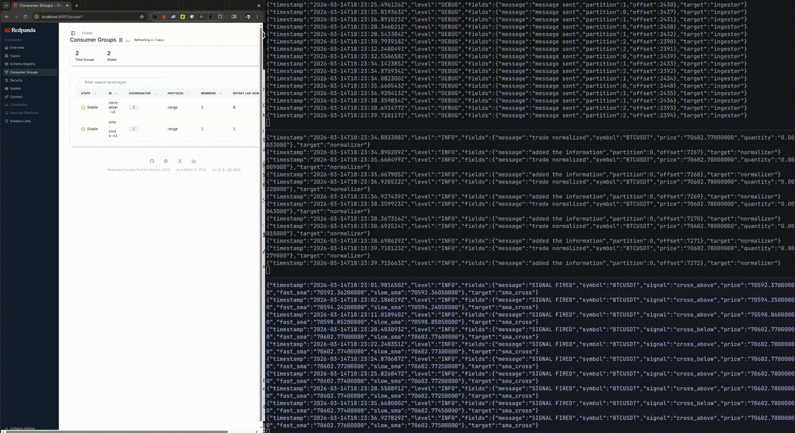

# trade-signal-pipeline

Real-time market data pipeline using Rust. 
Streams ticks from Binance websockets and generates SMA crossover signals.



## How it works

Ingestor - reads realtime ticks from Binance websockets -> raw-traces.btc (btc symbol, separate ingestor for each asset/pair for scalability)

Normizer - reads from raw-trades parses with sonic-rs shapes the tick and pushes to normalized-trades.btc

SMA-Cross - reads normalized-trades.btc calculates SMA and spots crossover signal pushing it to signals.btc

## Stack

- Rust (tokio, rdkafka, sonic-rs, rust_decimal)
- Apache Kafka 3.7 in KRaft mode (no Zookeeper)
- Redpanda Console for topic inspection
- Docker / Podman

## Prerequisites:

### Fedora / RHEL
```bash
sudo dnf install cmake gcc gcc-c++ make libcurl-devel openssl-devel
```

### Ubuntu / Debian
```bash
sudo apt install cmake build-essential libssl-dev libcurl4-openssl-dev
```

### macOS
```bash
brew install cmake
```

## Run
```bash
# start Kafka and Redpanda Console
podman compose up -d   # or: docker compose up -d

# three separate terminals
cargo run -p ingester
cargo run -p normalizer
cargo run -p sma-cross
```

Kafka UI shall be available at http://localhost:8080

## Configuration:

All settings via environment variables, with sane defaults for local development:

KAFKA_BROKERS (default=localhost:9092) - Kafka broker address

FAST_PERIOD (default=5) - Fast SMA period in ticks

SLOW_PERIOD (default=20) - Slow SMA period in ticks

KAFKA_TOPIC_NORMALIZED (default=normalized-trades.btc) - Input topic

KAFKA_TOPIC_SIGNALS (default=signals.btc) - Output topic

CONSUMER_GROUP (default=sma-cross-v1) - Kafka consumer group

KAFKA_BROKERS (default=localhost:9092) - Kafka broker address 

Override for a more active signal on demo:
```bash
FAST_PERIOD=3 SLOW_PERIOD=7 cargo run -p sma-cross
```

## Signal output

When SMA(fast) crosses:

Above SMA(slow) — bullish signal. 

Below — bearish.

Signals are published to `signals.btc` and logged to stdout:
```json
{
  "symbol": "BTCUSDT",
  "signal": "cross_above",
  "fast_sma": "83421.45",
  "slow_sma": "83401.12",
  "price": "83445.00",
  "timestamp_ms": 1741123200000
}
```

## Disclaimer

This project is for educational and demonstration purposes only.

SMA crossover alone is not a sufficient basis for trading decisions.

Nothing in this repository constitutes financial advice.

Use at your own risk. 
